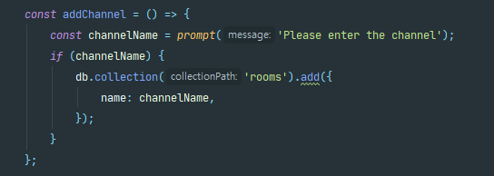
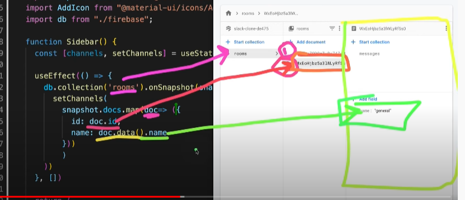
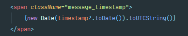
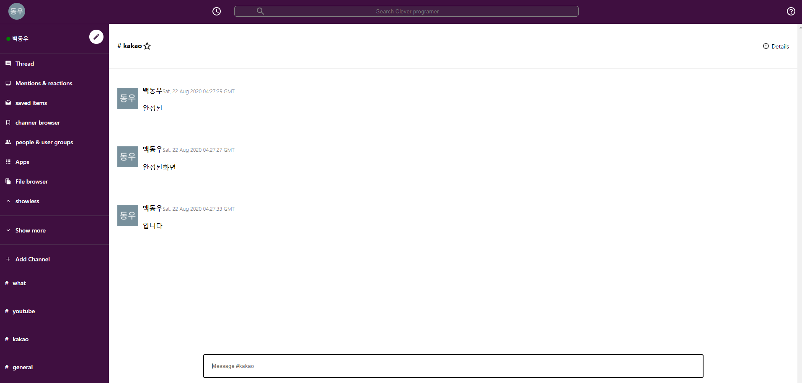

## Slack_Clone

## Building the SLACK app
* React JS
* Google User authentication(Firebase)
* React Context API(Redux)
* Material UI(Icons + Make it look beautiful)
* CSS Variables
* Firebox
* Deploy it with FIREBASE
* Real-time database(Firlbase)

#### DATE
Start date : 2020-08-20 ~ 20.08.21(about 8h)   
## Information
npm install firebase 
-> 2:57:00~ Add Google Authentication!!  

##### DB Data Input process(firebase)
 
##### DB Data Structure in source (firebase)
  
##### timestamp processing
  

##### Google Loign
* firebase->authentication->Google Access!! 
 
##### result screen
  

#### Demo Reference 
https://slack-clone-a8239.web.app

#### What I didn't know or confusing
1. strong : 굵은글씨  
2. onsnapshot(maybe firebase) : 메서드로 문서를 수신 대기   
3. useParams : url과 관련된 값들을 객체로 받을 수 있다.  
4. roomDetails?.name (.(dot))   (Maybe 존재하면 )
5. important : !important를 주는순간 우선순위 가장 높아짐  

###### Project_References 
Project : [LINK](https://www.youtube.com/watch?v=Oo4ziTddOxs)  
Thanks to [Clever Programmer](https://www.youtube.com/channel/UCqrILQNl5Ed9Dz6CGMyvMTQ) help, This project was able to succeed in making.
